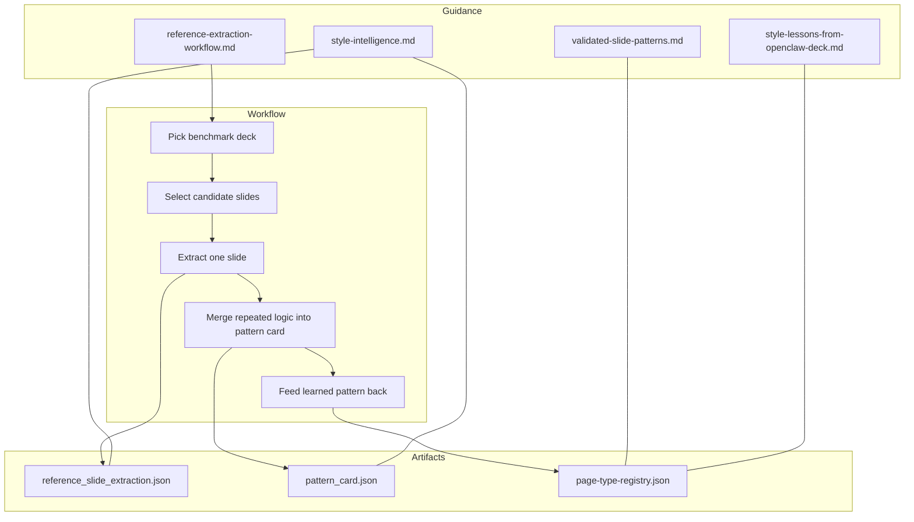
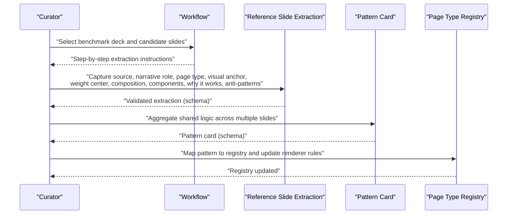
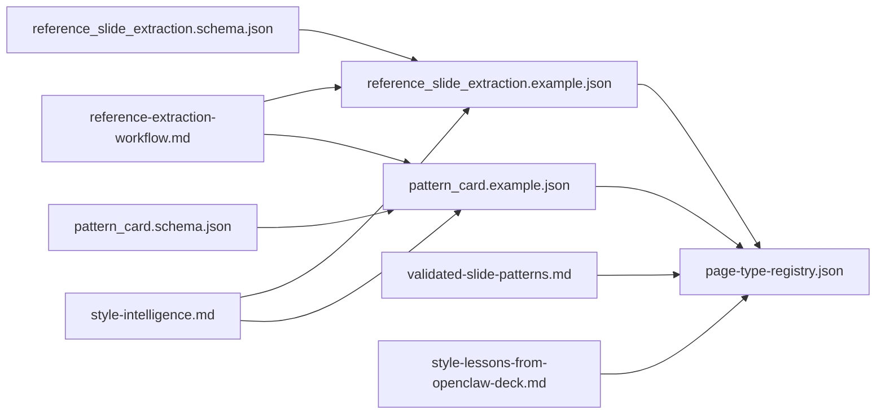

# Reference Extraction Process

<cite>
**Referenced Files in This Document**
- [reference-extraction-workflow.md](file://docs/workflows/reference-extraction-workflow.md)
- [style-intelligence.md](file://references/style-intelligence.md)
- [README.md](file://style/reference_extractions/README.md)
- [reference_slide_extraction.schema.json](file://schemas/reference_slide_extraction.schema.json)
- [pattern_card.schema.json](file://schemas/pattern_card.schema.json)
- [reference_slide_extraction.example.json](file://examples/reference_slide_extraction.example.json)
- [pattern_card.example.json](file://examples/pattern_card.example.json)
- [openclaw-executive--seed-01--cover-orbit.json](file://style/reference_extractions/openclaw-executive--seed-01--cover-orbit.json)
- [openclaw-executive--seed-02--bottleneck-shift.json](file://style/reference_extractions/openclaw-executive--seed-02--bottleneck-shift.json)
- [openclaw-executive--seed-03--chapter-summary-signal.json](file://style/reference_extractions/openclaw-executive--seed-03--chapter-summary-signal.json)
- [page-type-registry.json](file://style/patterns/page-type-registry.json)
- [validated-slide-patterns.md](file://references/validated-slide-patterns.md)
- [style-lessons-from-openclaw-deck.md](file://references/style-lessons-from-openclaw-deck.md)
</cite>

## Table of Contents
1. [Introduction](#introduction)
2. [Project Structure](#project-structure)
3. [Core Components](#core-components)
4. [Architecture Overview](#architecture-overview)
5. [Detailed Component Analysis](#detailed-component-analysis)
6. [Dependency Analysis](#dependency-analysis)
7. [Performance Considerations](#performance-considerations)
8. [Troubleshooting Guide](#troubleshooting-guide)
9. [Conclusion](#conclusion)
10. [Appendices](#appendices)

## Introduction
This document explains the Reference Extraction Process that powers the Deck Learning System. It describes how strong reference decks are ingested, analyzed, and transformed into reusable design patterns. The process converts raw presentation analysis into validated slide pattern generation, feeding the broader Style Intelligence system. It also documents how extracted patterns integrate into the pattern card library, improve automated style selection, and maintain a balance between manual curation and automated pattern recognition.

## Project Structure
The Reference Extraction ecosystem centers on structured artifacts and schemas:
- Workflows define the ingestion and transformation steps.
- Schemas validate the structure of reference slide extractions and pattern cards.
- Examples demonstrate real-world extractions and pattern cards.
- Reference extractions store individual slide-level analyses.
- The pattern registry maps page types to narrative roles and rendering guidance.
- Supporting references codify lessons, validated patterns, and style principles.

**Diagram sources**
- [reference-extraction-workflow.md:1-73](file://docs/workflows/reference-extraction-workflow.md#L1-L73)
- [style-intelligence.md:1-93](file://references/style-intelligence.md#L1-L93)
- [validated-slide-patterns.md:1-345](file://references/validated-slide-patterns.md#L1-L345)
- [style-lessons-from-openclaw-deck.md:1-161](file://references/style-lessons-from-openclaw-deck.md#L1-L161)
- [page-type-registry.json:1-115](file://style/patterns/page-type-registry.json#L1-L115)

**Section sources**
- [reference-extraction-workflow.md:1-73](file://docs/workflows/reference-extraction-workflow.md#L1-L73)
- [style-intelligence.md:1-93](file://references/style-intelligence.md#L1-L93)

## Core Components
- Reference Slide Extraction: Structured JSON capturing a single slide’s narrative role, page type candidate, visual anchor, weight center, composition, components, and validation notes.
- Pattern Card: Structured JSON summarizing reusable layout and alignment rules, image usage guidance, highlight grammar, component recipes, and anti-patterns.
- Page Type Registry: A curated catalog mapping page types to narrative roles, visual anchors, weight centers, density levels, and rendering targets.
- Workflow and Guidance: Prescriptive steps and quality standards for extraction, merging, and integration.

Key schema-driven validations ensure consistency and reusability across artifacts.

**Section sources**
- [reference_slide_extraction.schema.json:1-103](file://schemas/reference_slide_extraction.schema.json#L1-L103)
- [pattern_card.schema.json:1-75](file://schemas/pattern_card.schema.json#L1-L75)
- [page-type-registry.json:1-115](file://style/patterns/page-type-registry.json#L1-L115)

## Architecture Overview
The Reference Extraction Pipeline transforms a strong reference slide into reusable knowledge through five stages, validated by schemas and guided by style principles.

**Diagram sources**
- [reference-extraction-workflow.md:1-73](file://docs/workflows/reference-extraction-workflow.md#L1-L73)
- [reference_slide_extraction.schema.json:1-103](file://schemas/reference_slide_extraction.schema.json#L1-L103)
- [pattern_card.schema.json:1-75](file://schemas/pattern_card.schema.json#L1-L75)
- [page-type-registry.json:1-115](file://style/patterns/page-type-registry.json#L1-L115)

## Detailed Component Analysis

### Reference Slide Extraction
Purpose: Capture a single slide’s design rationale and reusable elements in a structured, schema-validated format.

Key fields and intent:
- Identification: reference_id, source (deck_id, slide_number, extraction_mode, file_path/image_path/source_note/tags).
- Narrative and typology: narrative_role, page_type_candidate, audience_tone.
- Composition: visual_anchor, weight_center, composition (structure, density_level, alignment_logic, asymmetry, image_usage, highlight_grammar), components list.
- Validation: why_it_works, anti_patterns, reuse_notes (safe_to_reuse, do_not_copy_blindly, adaptation_notes).

Extraction modes:
- direct_slide: when the original slide or screenshot is available.
- documented_seed: when reconstruction is based on documented lessons or validated patterns.

Quality standard: A good extraction explains what the slide is trying to do, why the layout works, where the visual weight sits, how images contribute to impact, and which rules are reusable in different topics.

Practical example references:
- Example extraction demonstrates a trust page with a terminal object as the visual anchor, right-weighted composition, and highlight grammar.
- Seed extractions reconstruct page types from documented lessons and validated patterns.

**Section sources**
- [reference_slide_extraction.schema.json:1-103](file://schemas/reference_slide_extraction.schema.json#L1-L103)
- [reference-extraction-workflow.md:1-73](file://docs/workflows/reference-extraction-workflow.md#L1-L73)
- [reference_slide_extraction.example.json:1-64](file://examples/reference_slide_extraction.example.json#L1-L64)
- [openclaw-executive--seed-01--cover-orbit.json:1-72](file://style/reference_extractions/openclaw-executive--seed-01--cover-orbit.json#L1-L72)
- [openclaw-executive--seed-02--bottleneck-shift.json:1-72](file://style/reference_extractions/openclaw-executive--seed-02--bottleneck-shift.json#L1-L72)
- [openclaw-executive--seed-03--chapter-summary-signal.json:1-72](file://style/reference_extractions/openclaw-executive--seed-03--chapter-summary-signal.json#L1-L72)

### Pattern Card
Purpose: Summarize reusable page logic derived from multiple reference slides.

Key fields and intent:
- Identity: id, page_type, source_references, narrative_roles, topic_fit.
- Visual identity: visual_anchor, weight_center.
- Layout and alignment: layout_rules, alignment_rules.
- Image usage: image_usage (required, mode, placement_guidance).
- Highlight grammar: highlight_grammar.
- Components: component_recipe.
- Editability: editable_target.
- Anti-patterns and notes: anti_patterns, reuse_notes.

Pattern cards are created when multiple slides share the same reusable logic, enabling standardized rendering and QA checks.

Practical example references:
- Example pattern card shows a trust terminal pattern with layout rules, alignment rules, image usage guidance, highlight grammar, and anti-patterns.

**Section sources**
- [pattern_card.schema.json:1-75](file://schemas/pattern_card.schema.json#L1-L75)
- [pattern_card.example.json:1-54](file://examples/pattern_card.example.json#L1-L54)

### Page Type Registry
Purpose: Provide a canonical mapping of page types to narrative roles, visual anchors, weight centers, density levels, and rendering targets.

Role in the pipeline:
- After a pattern card stabilizes, it is mapped into the registry.
- Renderer rules are updated only after the pattern is clearly reusable.
- QA checks are added when the pattern has known failure modes.

Practical example references:
- Registry enumerates page types such as cover_orbit, trust_terminal, bottleneck_shift, chapter_summary_signal, and others, each with associated narrative roles and editable targets.

**Section sources**
- [page-type-registry.json:1-115](file://style/patterns/page-type-registry.json#L1-L115)

### Workflow and Quality Standards
The workflow defines:
- Choosing benchmark decks strong on executive clarity, image usage, visual hierarchy, alignment discipline, and editable-friendly composition.
- Selecting stable enterprise page needs (cover, chapter opener, agenda, architecture, strategic shift, summary).
- Extracting one slide with a prescribed set of fields and notes.
- Merging repeated logic into pattern cards.
- Feeding the learned pattern back into the registry and renderer rules.

Quality review standard:
- A good extraction is not a screenshot summary; it explains the slide’s purpose, why the layout works, visual weight, image contribution, and reusable rules.

**Section sources**
- [reference-extraction-workflow.md:1-73](file://docs/workflows/reference-extraction-workflow.md#L1-L73)

### Style Intelligence and Related References
Style Intelligence stores:
- Reference samples (images/screenshots, metadata, tags, quality notes).
- Pattern library (page types, topic fit, visual anchors, layout rules, hierarchy rules, anti-patterns).
- Theme library (color palettes, typography, spacing, borders, shadows, backgrounds).
- Component library (reusable objects).

Related references codify lessons and validated patterns:
- Style lessons from the OpenClaw executive deck.
- Validated slide patterns with concrete structures, strengths, and anti-patterns.

These resources inform extraction quality and ensure that patterns reflect real, effective designs.

**Section sources**
- [style-intelligence.md:1-93](file://references/style-intelligence.md#L1-L93)
- [style-lessons-from-openclaw-deck.md:1-161](file://references/style-lessons-from-openclaw-deck.md#L1-L161)
- [validated-slide-patterns.md:1-345](file://references/validated-slide-patterns.md#L1-L345)

## Dependency Analysis
The extraction pipeline depends on schemas, examples, and reference materials to maintain consistency and quality.

**Diagram sources**
- [reference_slide_extraction.schema.json:1-103](file://schemas/reference_slide_extraction.schema.json#L1-L103)
- [pattern_card.schema.json:1-75](file://schemas/pattern_card.schema.json#L1-L75)
- [reference-extraction-workflow.md:1-73](file://docs/workflows/reference-extraction-workflow.md#L1-L73)
- [style-intelligence.md:1-93](file://references/style-intelligence.md#L1-L93)
- [validated-slide-patterns.md:1-345](file://references/validated-slide-patterns.md#L1-L345)
- [style-lessons-from-openclaw-deck.md:1-161](file://references/style-lessons-from-openclaw-deck.md#L1-L161)

**Section sources**
- [reference_slide_extraction.schema.json:1-103](file://schemas/reference_slide_extraction.schema.json#L1-L103)
- [pattern_card.schema.json:1-75](file://schemas/pattern_card.schema.json#L1-L75)
- [reference-extraction-workflow.md:1-73](file://docs/workflows/reference-extraction-workflow.md#L1-L73)
- [style-intelligence.md:1-93](file://references/style-intelligence.md#L1-L93)
- [validated-slide-patterns.md:1-345](file://references/validated-slide-patterns.md#L1-L345)
- [style-lessons-from-openclaw-deck.md:1-161](file://references/style-lessons-from-openclaw-deck.md#L1-L161)

## Performance Considerations
- Schema validation reduces downstream errors and ensures consistent transformations from reference slide extractions to pattern cards.
- Using documented seeds accelerates early-stage learning when original slides are unavailable, deferring to direct_slide updates when originals become available.
- Maintaining a curated page-type registry prevents redundant rendering logic and improves automated style selection performance.

## Troubleshooting Guide
Common issues and resolutions:
- Missing or incorrect extraction_mode: Use documented_seed when reconstructing from lessons or validated patterns; switch to direct_slide when originals are available.
- Incomplete composition fields: Ensure structure, density_level, alignment_logic, image_usage, and highlight_grammar are populated consistently.
- Anti-patterns not recorded: Document what should not be copied blindly to avoid regressions.
- Pattern card not merged: Verify that multiple slides share sufficient reusable logic; otherwise, keep separate extractions.
- Registry mapping delays: Update renderer rules only after patterns are stable and have known failure modes captured in QA.

**Section sources**
- [reference-extraction-workflow.md:1-73](file://docs/workflows/reference-extraction-workflow.md#L1-L73)
- [reference_slide_extraction.schema.json:1-103](file://schemas/reference_slide_extraction.schema.json#L1-L103)
- [pattern_card.schema.json:1-75](file://schemas/pattern_card.schema.json#L1-L75)

## Conclusion
The Reference Extraction Process systematically transforms strong reference slides into validated, reusable design patterns. By adhering to schema-driven structures, quality standards, and curated registries, the system builds Style Intelligence that informs automated style selection and improves rendering outcomes. The balance between manual curation and automated pattern recognition is maintained through documented seeds, robust validation, and iterative refinement.

## Appendices

### Extraction Workflow Steps
- Pick the Right Benchmark Deck: Prefer decks strong on executive clarity, image usage, visual hierarchy, alignment discipline, and editable-friendly composition.
- Select Candidate Slides: Focus on stable enterprise page needs (cover, chapter opener, agenda, architecture, strategic shift, summary).
- Extract One Slide: Capture source path/screenshot path, page claim, narrative role, page type candidate, visual anchor and weight center, alignment logic, image usage, highlight grammar, why it works, and anti-patterns.
- Merge Repeated Logic into a Pattern Card: Create pattern cards when multiple references share reusable logic; summarize layout rules, alignment rules, image usage, and anti-patterns.
- Feed the Learned Pattern Back: Map stable patterns to the page-type registry, update renderer rules, and add QA checks for known failure modes.

**Section sources**
- [reference-extraction-workflow.md:1-73](file://docs/workflows/reference-extraction-workflow.md#L1-L73)

### Practical Pattern Extraction Techniques
- Rule identification: Identify layout rules (e.g., left concept block plus right hero object) and alignment rules (e.g., shared top/bottom bounds).
- Composition analysis: Describe structure, density level, alignment logic, asymmetry, image usage, and highlight grammar.
- Component mapping: Enumerate components with roles and types to guide rendering.
- Quality validation: Document why a slide works and what should not be copied blindly; include reuse notes for adaptation guidance.

**Section sources**
- [reference_slide_extraction.schema.json:1-103](file://schemas/reference_slide_extraction.schema.json#L1-L103)
- [pattern_card.schema.json:1-75](file://schemas/pattern_card.schema.json#L1-L75)
- [reference_slide_extraction.example.json:1-64](file://examples/reference_slide_extraction.example.json#L1-L64)
- [pattern_card.example.json:1-54](file://examples/pattern_card.example.json#L1-L54)

### Relationship Between Reference Extraction and Style Intelligence
- Style Intelligence stores reference samples, pattern library, theme library, and component library.
- Reference extractions feed the pattern library; validated patterns inform the page-type registry.
- Style lessons and validated patterns guide extraction quality and ensure reusable, effective designs.

**Section sources**
- [style-intelligence.md:1-93](file://references/style-intelligence.md#L1-L93)
- [validated-slide-patterns.md:1-345](file://references/validated-slide-patterns.md#L1-L345)
- [style-lessons-from-openclaw-deck.md:1-161](file://references/style-lessons-from-openclaw-deck.md#L1-L161)