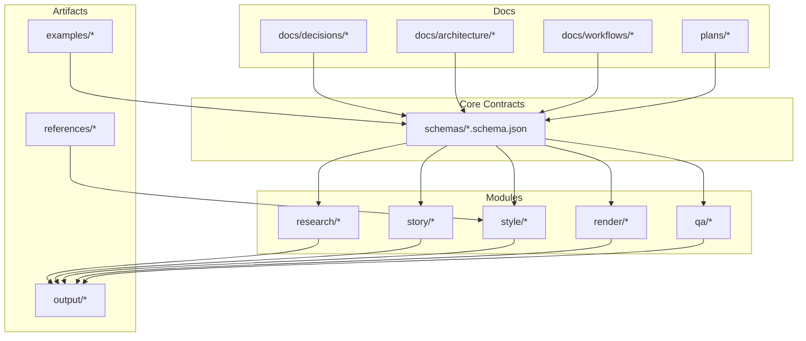
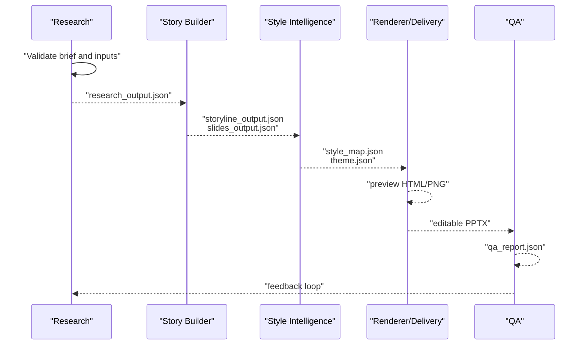
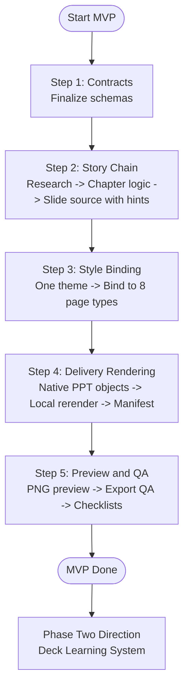
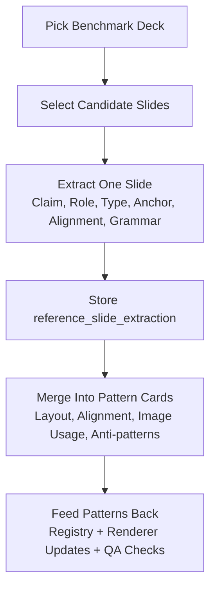
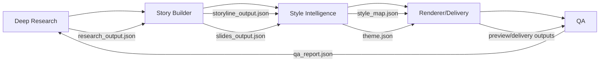
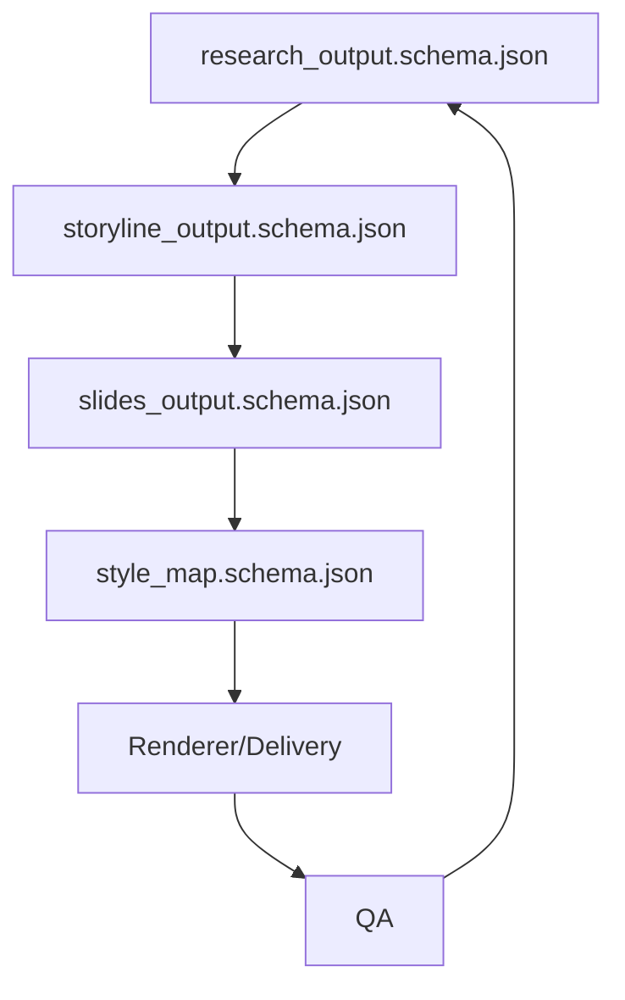

# Workflows and Processes

<cite>
**Referenced Files in This Document**
- [fast-track-mvp.md](file://docs/workflows/fast-track-mvp.md)
- [mvp-scope.md](file://docs/workflows/mvp-scope.md)
- [reference-extraction-workflow.md](file://docs/workflows/reference-extraction-workflow.md)
- [deck-learning-system.md](file://docs/architecture/deck-learning-system.md)
- [module-boundaries.md](file://docs/architecture/module-boundaries.md)
- [ADR-0003-fast-track-mvp.md](file://docs/decisions/ADR-0003-fast-track-mvp.md)
- [ADR-0001-layered-pipeline.md](file://docs/decisions/ADR-0001-layered-pipeline.md)
- [ADR-0002-editable-pptx-strategy.md](file://docs/decisions/ADR-0002-editable-pptx-strategy.md)
- [mvp-roadmap.md](file://plans/mvp-roadmap.md)
- [PROJECT_BLUEPRINT.md](file://PROJECT_BLUEPRINT.md)
- [final-acceptance.md](file://qa/checklists/final-acceptance.md)
- [slides_output.schema.json](file://schemas/slides_output.schema.json)
- [style_map.schema.json](file://schemas/style_map.schema.json)
- [research_output.schema.json](file://schemas/research_output.schema.json)
- [storyline_output.schema.json](file://schemas/storyline_output.schema.json)
</cite>

## Table of Contents
1. [Introduction](#introduction)
2. [Project Structure](#project-structure)
3. [Core Components](#core-components)
4. [Architecture Overview](#architecture-overview)
5. [Detailed Component Analysis](#detailed-component-analysis)
6. [Dependency Analysis](#dependency-analysis)
7. [Performance Considerations](#performance-considerations)
8. [Troubleshooting Guide](#troubleshooting-guide)
9. [Conclusion](#conclusion)
10. [Appendices](#appendices)

## Introduction
This document explains the Enterprise PPT System’s operational workflows and development methodology. It focuses on the fast-track MVP workflow, reference extraction processes, and scope definition strategies. It also documents iterative development cycles, milestone tracking, and progress measurement systems, and provides practical examples of workflow execution, process optimization, and team coordination. The relationship between development workflows and business requirements is addressed alongside change management, risk mitigation, and quality assurance integration. Best practices for process improvement and scaling operations are included.

## Project Structure
The repository is organized around layered modules and clear data contracts:
- docs: Architectural decisions, workflows, and blueprint documentation
- plans: Roadmaps and milestones
- schemas: JSON schemas defining module contracts
- research, story, style, render, qa: Feature areas and outputs
- skills: Capability definitions and guidance
- references: External and internal knowledge assets
- examples: Sample artifacts for validation and demonstration
- output: Versioned delivery, preview, and QA artifacts

**Diagram sources**
- [module-boundaries.md:1-151](file://docs/architecture/module-boundaries.md#L1-L151)
- [PROJECT_BLUEPRINT.md:218-276](file://PROJECT_BLUEPRINT.md#L218-L276)

**Section sources**
- [module-boundaries.md:1-151](file://docs/architecture/module-boundaries.md#L1-L151)
- [PROJECT_BLUEPRINT.md:218-276](file://PROJECT_BLUEPRINT.md#L218-L276)

## Core Components
- Fast-Track MVP Plan: Defines the MVP scope, build order, and acceptance criteria aligned with a delivery-first path.
- MVP Scope: Clarifies in/out-of-scope items and acceptance gates for the MVP.
- Reference Extraction Workflow: Structured process to convert strong reference slides into reusable design knowledge.
- Deck Learning System: Systematic ingestion and abstraction of layout, alignment, and image usage rules from external decks.
- Module Boundaries: Enforces separation of concerns across research, story, style, rendering, and QA.
- Architectural Decisions (ADRs): Layered pipeline, editable PPTX strategy, and fast-track MVP rationale.
- Roadmap: Phased deliverables and exit criteria for each phase.
- QA Checklists: Final acceptance criteria and QA gates.

**Section sources**
- [fast-track-mvp.md:1-75](file://docs/workflows/fast-track-mvp.md#L1-L75)
- [mvp-scope.md:1-44](file://docs/workflows/mvp-scope.md#L1-L44)
- [reference-extraction-workflow.md:1-73](file://docs/workflows/reference-extraction-workflow.md#L1-L73)
- [deck-learning-system.md:1-37](file://docs/architecture/deck-learning-system.md#L1-L37)
- [module-boundaries.md:1-151](file://docs/architecture/module-boundaries.md#L1-L151)
- [ADR-0003-fast-track-mvp.md:1-29](file://docs/decisions/ADR-0003-fast-track-mvp.md#L1-L29)
- [ADR-0001-layered-pipeline.md:1-24](file://docs/decisions/ADR-0001-layered-pipeline.md#L1-L24)
- [ADR-0002-editable-pptx-strategy.md:1-28](file://docs/decisions/ADR-0002-editable-pptx-strategy.md#L1-L28)
- [mvp-roadmap.md:1-68](file://plans/mvp-roadmap.md#L1-L68)
- [final-acceptance.md:1-28](file://qa/checklists/final-acceptance.md#L1-L28)

## Architecture Overview
The system follows a layered pipeline with explicit module boundaries and shared contracts. The canonical flow moves from structured research to storyline, slides, style decisions, preview, editable PPTX, and QA.

**Diagram sources**
- [module-boundaries.md:6-151](file://docs/architecture/module-boundaries.md#L6-L151)
- [PROJECT_BLUEPRINT.md:46-217](file://PROJECT_BLUEPRINT.md#L46-L217)

**Section sources**
- [module-boundaries.md:6-151](file://docs/architecture/module-boundaries.md#L6-L151)
- [PROJECT_BLUEPRINT.md:46-217](file://PROJECT_BLUEPRINT.md#L46-L217)

## Detailed Component Analysis

### Fast-Track MVP Workflow
The fast-track MVP workflow prioritizes shipping a usable, editable, and reviewable product quickly while preserving editability and basic quality. It narrows scope to a single deck category, a single theme family, and eight page types, with PPTX-first rendering and preview derived from PPTX.

Key elements:
- Objective and chosen path: single category, single theme, 8 page types, PPTX-first rendering, preview from PPTX, QA before style expansion.
- Why this path: reduces early renderer costs, concentrates style quality, preserves layered model.
- Build order:
  - Contracts: finalize schemas for research_output, storyline_output, slides_output, style_map, theme.
  - Story Chain: structured research input → chapter logic → slide source with page_type_hint.
  - Style Binding: one theme, bind slides to 8 page types, manual override when hints are weak.
  - Delivery Rendering: map 8 page types to native PPT objects, local rerender by slide id, versioned manifest.
  - Preview and QA: rasterize PPTX to preview PNG, export QA, content and visual checklists.
- Required MVP page types: cover_orbit, narrative_map, trust_terminal, bottleneck_shift, layered_architecture_stack, scenario_flow, risk_split, chapter_summary_signal.
- Not now: new theme families, style-memory automation, complex cross-page design systems, generalized component abstraction, standalone HTML preview renderer, automated deck learning, and full automatic page-type selection.
- MVP Done Means: one topic from structured research to editable PPTX, reviewable via PNG previews, local rerender, and non-generic appearance.
- Phase Two Direction: add Deck Learning System to ingest strong reference decks, extract reusable layout and image rules, expand pattern cards, and feed learned rules back into style intelligence and renderer upgrades.

**Diagram sources**
- [fast-track-mvp.md:19-75](file://docs/workflows/fast-track-mvp.md#L19-L75)

**Section sources**
- [fast-track-mvp.md:1-75](file://docs/workflows/fast-track-mvp.md#L1-L75)
- [ADR-0003-fast-track-mvp.md:6-29](file://docs/decisions/ADR-0003-fast-track-mvp.md#L6-L29)

### MVP Scope Definition Strategies
Scope is defined by narrowing the deck category, aspect ratio, theme family, and page types, and by enforcing structured handoffs and editable delivery. Acceptance criteria ensure coherence, consistency, editability, and QA coverage.

Key elements:
- Goal: Produce one strong category of enterprise strategy deck from structured research input to editable PPTX.
- In scope: 16:9 layout, one theme family (dark enterprise tech), 8 priority page types, structured handoff, editable PPTX, preview PNG from PPTX, local rerender by slide id, content/visual/export QA, semi-automatic style binding from page_type_hint.
- Priority page types: cover_orbit, narrative_map, trust_terminal, bottleneck_shift, layered_architecture_stack, scenario_flow, risk_split, chapter_summary_signal.
- Out of scope: arbitrary deck styles, all industries, full automated deep research stack, image-only final delivery, no-review one-click production, standalone HTML preview renderer, full automatic page-type selection, generalized component library beyond MVP page types.
- Acceptance: example research input validates, every slide has one primary claim, 8 priority page types render consistently, delivery deck is editable, preview PNG derivable from delivery deck, QA catches common content, style, and export defects.

**Section sources**
- [mvp-scope.md:1-44](file://docs/workflows/mvp-scope.md#L1-L44)

### Reference Extraction Workflow
This workflow converts strong reference slides into structured design knowledge. It emphasizes explaining why a layout works, what should be reused, and what should not be copied literally.

Key steps:
- Purpose: Convert a strong reference slide into structured design knowledge.
- Outputs: One reference_slide_extraction per slide; one or more pattern_cards when multiple references share reusable logic.
- Step 1: Pick the right benchmark deck (strong on executive clarity, image usage, visual hierarchy, alignment discipline, editable-friendly composition; avoid motion, dense illustration, or full-page raster).
- Step 2: Select candidate slides (covers, chapter openers, narrative maps, architecture/operating models, strategic shifts/before/after, summaries/closing signals).
- Step 3: Extract one slide (capture source and screenshot paths, write page claim, identify narrative role, candidate page type, describe visual anchor and weight center, document alignment logic, image usage, and highlight grammar, list why it works and what not to copy).
- Step 4: Merge repeated logic into a pattern card (summarize layout and alignment rules, image usage and editable targets, record anti-patterns).
- Step 5: Feed learned patterns back (map to style/patterns/page-type-registry.json, update renderer rules after pattern stability, add QA checks for known failure modes).
- Review standard: A good extraction explains what the slide is trying to do, why the layout works, where visual weight sits, how images contribute to impact, and which rules are reusable in different topics.

**Diagram sources**
- [reference-extraction-workflow.md:10-73](file://docs/workflows/reference-extraction-workflow.md#L10-L73)

**Section sources**
- [reference-extraction-workflow.md:1-73](file://docs/workflows/reference-extraction-workflow.md#L1-L73)
- [deck-learning-system.md:16-37](file://docs/architecture/deck-learning-system.md#L16-L37)

### Deck Learning System
The Deck Learning System turns strong external decks into reusable page knowledge. It ingests reference decks, extracts slides, merges repeated patterns, and feeds learned rules back into style intelligence and renderer upgrades.

Key elements:
- Goal: Turn strong external decks into reusable page knowledge, not static inspiration.
- What it learns: page types, layout skeletons, alignment logic, weight center, visual anchors, image usage, highlight grammar, anti-patterns.
- Minimal workflow: ingest reference deck/pdf/screenshots → extract slides into reference_slide_extraction → merge into pattern_card → feed into style intelligence → verify with renderer upgrades and QA.
- First iteration scope: start with one strong benchmark deck, extract 3–5 representative slides, create 3–5 pattern cards, focus on reusable executive page types.
- Storage model: raw assets in references/ or external storage; extracted cards in style/reference_extractions/; reusable patterns in style/patterns/.
- Golden rule: do not store only screenshots; store why the page works, what should be reused, and what should not be copied literally.

**Section sources**
- [deck-learning-system.md:1-37](file://docs/architecture/deck-learning-system.md#L1-L37)

### Module Boundaries and Responsibilities
Module boundaries separate judgment from execution and enforce structured handoffs. Each module owns specific responsibilities and must not own others to maintain independence and testability.

Key responsibilities:
- Deep Research: produce research_output.json and source_map.md; must not decide slide order, page geometry, theme, or final page type.
- Story Builder: produce storyline_output.json and slides_output.json; must not decide token-level style, x/y positions, or PPT object mapping.
- Style Intelligence: produce style_map.json and theme.json; must not decide research facts, chapter structure, or export format.
- Renderer: produce preview HTML/PNG, editable PPTX, and render_manifest.json; must not decide research interpretation, storyline rewrite, or pattern knowledge authoring.
- QA: produce qa_report.json and fix lists; must not decide to silently rewrite content or restyle pages.

**Diagram sources**
- [module-boundaries.md:6-151](file://docs/architecture/module-boundaries.md#L6-L151)

**Section sources**
- [module-boundaries.md:6-151](file://docs/architecture/module-boundaries.md#L6-L151)

### Iterative Development Cycles, Milestone Tracking, and Progress Measurement
The roadmap defines phased deliverables and exit criteria for each phase, ensuring measurable progress and clear gates.

Phases and deliverables:
- Phase 0: Foundations (project structure, schemas, theme token format, page-type registry)
- Phase 1: Deep Research Input (research output schema, source map format, research-to-story handoff format)
- Phase 2: Story Builder (storyline generator, slide content generator, chapter/page validation rules)
- Phase 3: Style Binding (fixed dark-tech theme, 8 controlled page types, rule-based style binding from page_type_hint)
- Phase 4: Editable PPT Renderer (native PPT object mapping for priority page types, editable PPTX export, versioned outputs, local rerender)
- Phase 5: Preview and QA (PNG preview from PPTX output, content QA checklist, visual QA checklist, export QA checks)
- Phase 6: Deck Learning System (reference deck ingestion, slide decomposition format, pattern extraction cards, layout/alignment/image usage rules, benchmark gallery)

Exit criteria for MVP:
- Preview deck is narratively coherent
- 8 page types render consistently
- Editable PPTX output works
- Local page rerender works
- QA checklist can catch common failures

Post-MVP goal:
- Learn from strong external decks and convert references into reusable page knowledge, not static inspiration.

**Section sources**
- [mvp-roadmap.md:1-68](file://plans/mvp-roadmap.md#L1-L68)

### Practical Examples of Workflow Execution
- Executing the fast-track MVP:
  - Validate brief and inputs (contracts)
  - Run research intake and validation
  - Build storyline and slide content
  - Bind style to 8 page types using page_type_hint
  - Render preview and editable PPTX
  - Run export QA and content/visual checklists
  - Measure progress against MVP acceptance criteria
- Executing reference extraction:
  - Choose a benchmark deck strong on clarity, image usage, visual hierarchy, alignment discipline, and editable-friendly composition
  - Select candidate slides representing stable enterprise page needs
  - Extract one slide into a structured reference_slide_extraction
  - Merge repeated logic into pattern cards
  - Feed patterns back into style intelligence and renderer upgrades
- Coordinating teams:
  - Deep Research provides validated research_output.json
  - Story Builder produces slides_output.json with page_type_hint
  - Style Intelligence binds page types and produces style_map.json and theme.json
  - Renderer produces preview and editable outputs
  - QA gates acceptance and provides feedback

[No sources needed since this section synthesizes previously cited workflows]

### Process Optimization and Team Coordination Procedures
- Shared contracts: JSON schemas define inputs/outputs for each module, enabling independent development and reruns.
- Local rerender: allows fixing issues without rebuilding the entire deck.
- Preview from PPTX: reduces preview-delivery drift by deriving preview from the same PPTX.
- Semi-automatic style binding: accelerates style decisions while retaining manual override capability.
- QA gates: content, visual, and export checks ensure consistent quality and defensible outcomes.
- Change management: ADRs formalize architectural decisions; scope documents define in/out-of-scope items; roadmaps track milestones; QA checklists define acceptance criteria.
- Risk mitigation: layered pipeline prevents mixing story and rendering too early; editable PPTX ensures local revisability; deck learning system prevents template collapse by focusing on reusable rules.

**Section sources**
- [ADR-0001-layered-pipeline.md:1-24](file://docs/decisions/ADR-0001-layered-pipeline.md#L1-L24)
- [ADR-0002-editable-pptx-strategy.md:1-28](file://docs/decisions/ADR-0002-editable-pptx-strategy.md#L1-L28)
- [final-acceptance.md:1-28](file://qa/checklists/final-acceptance.md#L1-L28)

### Relationship Between Development Workflows and Business Requirements
- Business requirement: enterprise PPTs must be editable, reviewable, and locally revisable.
- Workflow alignment: editable PPTX as first-class output, preview derived from PPTX, local rerender, QA gates, and structured handoffs.
- Quality assurance integration: QA checklists and reports ensure factual defensibility, narrative quality, visual intentionality, and export integrity.
- Scalability: deck learning system converts external references into reusable knowledge, reducing reliance on manual design decisions.

**Section sources**
- [PROJECT_BLUEPRINT.md:5-22](file://PROJECT_BLUEPRINT.md#L5-L22)
- [ADR-0002-editable-pptx-strategy.md:9-28](file://docs/decisions/ADR-0002-editable-pptx-strategy.md#L9-L28)
- [final-acceptance.md:26-28](file://qa/checklists/final-acceptance.md#L26-L28)

## Dependency Analysis
The system relies on shared schemas and structured handoffs across modules. Dependencies are unidirectional along the canonical flow, with QA providing feedback loops.

**Diagram sources**
- [research_output.schema.json:1-88](file://schemas/research_output.schema.json#L1-L88)
- [storyline_output.schema.json:1-49](file://schemas/storyline_output.schema.json#L1-L49)
- [slides_output.schema.json:1-53](file://schemas/slides_output.schema.json#L1-L53)
- [style_map.schema.json:1-70](file://schemas/style_map.schema.json#L1-L70)

**Section sources**
- [research_output.schema.json:1-88](file://schemas/research_output.schema.json#L1-L88)
- [storyline_output.schema.json:1-49](file://schemas/storyline_output.schema.json#L1-L49)
- [slides_output.schema.json:1-53](file://schemas/slides_output.schema.json#L1-L53)
- [style_map.schema.json:1-70](file://schemas/style_map.schema.json#L1-L70)

## Performance Considerations
- Local rerender reduces rebuild time by targeting affected pages only.
- Preview derived from PPTX minimizes divergence between preview and delivery.
- Shared page-type registry and theme token system across preview and delivery improves consistency and reduces rework.
- Structured handoffs and QA gates prevent costly rework by catching issues earlier.

[No sources needed since this section provides general guidance]

## Troubleshooting Guide
Common issues and remedies:
- Preview-delivery drift: ensure preview is derived from the same PPTX output and that page-type rules are shared across renderers.
- Template-like outputs: enforce style binding with page_type_hint and use pattern cards to avoid generic layouts.
- Editability problems: verify editable PPTX export and ensure native object mapping preserves text and shapes.
- QA misses: add explicit checks to QA rules and ensure reviewers apply the final acceptance checklist.

**Section sources**
- [ADR-0002-editable-pptx-strategy.md:14-28](file://docs/decisions/ADR-0002-editable-pptx-strategy.md#L14-L28)
- [final-acceptance.md:1-28](file://qa/checklists/final-acceptance.md#L1-L28)

## Conclusion
The Enterprise PPT System’s workflows emphasize a fast-track MVP with a delivery-first path, structured handoffs, and QA gates. The reference extraction and deck learning system convert external excellence into reusable design knowledge. The layered pipeline, shared contracts, and local rerender enable scalable, editable, and reviewable enterprise presentations. By adhering to documented scope, milestones, and acceptance criteria, teams can coordinate effectively, mitigate risks, and continuously improve processes.

[No sources needed since this section summarizes without analyzing specific files]

## Appendices
- Architectural Decisions:
  - Layered pipeline: separates judgment from execution and enables independent development.
  - Editable PPTX strategy: prioritizes native editable PPTX as first-class output.
  - Fast-track MVP: chooses a narrow scope to accelerate delivery while preserving quality.
- QA and Acceptance:
  - Final acceptance checklist defines content, story, visual, and export standards.
  - QA reports and fix lists provide reproducible quality gates.

**Section sources**
- [ADR-0001-layered-pipeline.md:1-24](file://docs/decisions/ADR-0001-layered-pipeline.md#L1-L24)
- [ADR-0002-editable-pptx-strategy.md:1-28](file://docs/decisions/ADR-0002-editable-pptx-strategy.md#L1-L28)
- [ADR-0003-fast-track-mvp.md:1-29](file://docs/decisions/ADR-0003-fast-track-mvp.md#L1-L29)
- [final-acceptance.md:1-28](file://qa/checklists/final-acceptance.md#L1-L28)